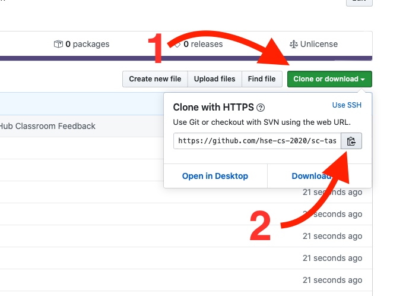

# 🎒📓💻 Task 1

**NOTE: If you just fork this repository it will not be graded. Ask your supervisor for a special GitHub classroom URL.**

## How to do the task

Your task is to write a valid definition for every function declared in `src/Task.hs`. All functions have a comment describing what the function needs to do with some examples.

There are predefined tests for you to check your answer. You can look at the tests for some more usage examples in `test/Tests.hs`.

After defining all functions you then need to commit **and push** your code to your repository. An automated script will then check your solution and give you feedback as a CI result in your GitHub repository.

## Prerequisites

### Haskell Stack

First of all, you need to install [haskell stack](https://docs.haskellstack.org/en/stable/README/). To do that you can follow the [installation instructions on the website](https://docs.haskellstack.org/en/stable/README/#how-to-install).

Stack will manage to install the compiler and all required libraries when you try to compile a Haskell stack project. (The first time it might take a while, but when you will try to run it again, it will use the already installed tools).

Stack is also a sort of meta build system. It is "meta" because stack doesn't build anything -- it tells *cabal* how to build your project with the installed compiler and libraries. *Cabal* is to Haskell what the *CMake* is to C++.

### Git

If you are running macOS or Linux you should already have some version of git installed on your system. If you do not, or if you are running windows, you will need to install git. You can do so by following this [git installation tutorial](https://www.atlassian.com/git/tutorials/install-git).

## Cloning your project

After you follow the special URL, you should finally end up on your github project.

You will then want to grab the cloning URL:



And in you terminal, navigate to where you would like to store your project and clone the git repo:

```bash
git clone https://github.com/hse-cs-2020/sc-task-1-ilyakooo0.git
```

### Making sure it build

After you have cloned your project you should make sure you have everything set up and working properly.

Navigate to the project folder and run the following command:

```bash
stack test
```

This should download the compiler, download all necessary libraries and run the test in your project.

## IDE

The easiest way to develop is to use the [IntelliJ plugin for Haskell](https://github.com/rikvdkleij/intellij-haskell).


Unfortunately, the latest versions of the plugin are not available in the IntelliJ marketplace, so it is recommended that you download it from [the "Releases" tab on github](https://github.com/rikvdkleij/intellij-haskell/releases):


You then need to install it from disk:


To install and use it you can follow [the instructions given in the project readme](https://github.com/rikvdkleij/intellij-haskell#getting-started).


**NOTE: You need to make sure the project builds before importing**

**NOTE: You need to choose "Project from Existing Sources..." in IntelliJ**

When you first open a project, IntelliJ will download and build all the required tools to give you feedback about your project. (This may take a while, but is only required once)

## Build and test

Unfortunately, *IntelliJ plugin for Haskell* doesn't currently support building your project directly from the IDE, so you will have to build your project and run tests from the terminal.

All subsequent commands are assumed to be run when the current directory is the root of your project.

After you have installed stack, you can build your project by running `stack build` in the directory of your project. This will build the code of your library.

To run tests on your code you can write `stack test`.

**NOTE: you don't have to write `stack build` if you want to test your project. Running `stack test` will automatically build any necessary modules.**

You can experiment with your functions by running `stack ghci`. This will build your library and launch an interactive shell with all of the functions already loaded. You can then just call your functions directly.

### Lifehack

If you try to display your types in the console, you will get errors.

To get rid of the errors you have to add `deriving Show` to the definition like so:

```haskell
data Foo = Bar
  deriving Show
```

## Submitting you solution

You can submit the solution to your solution to GitHub using IntlliJ.

To do this you can go to "VCS > Commit...":


After that you will need to write a commit message.

**NOTE: Don't forget to push your commit. You can commit and push at the same time.**


## FAQ

> Can I add extra functions in the `Task.hs` file?

Yes, you can, but you can not remove existing functions.
